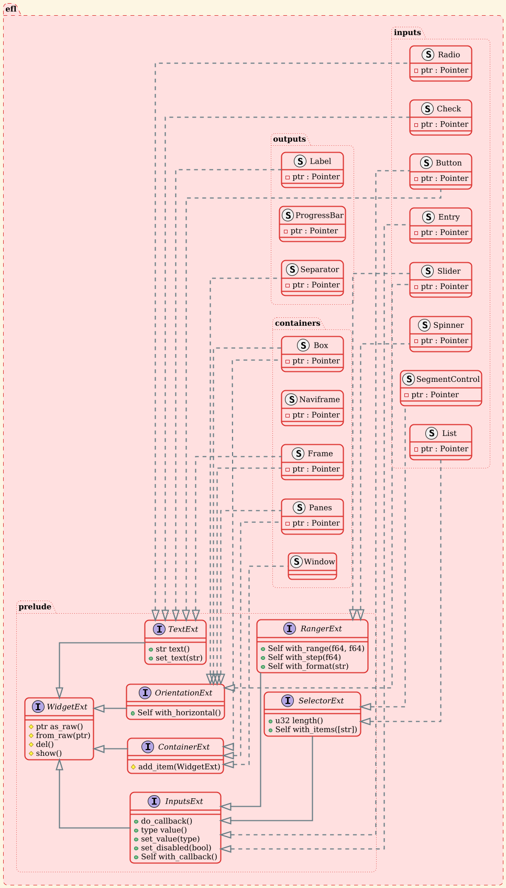

# efl-rs

Rust bindings for the [Enlightenment Foundation Libraries](https://www.enlightenment.org/about-efl).

## Other bindings for EFL

- [Python](https://github.com/DaveMDS/python-efl)
- [Vala](https://github.com/freesmartphone/libeflvala)

## Alternatives

- [FLTK-rs](https://github.com/fltk-rs)
- [GTK-rs](https://github.com/gtk-rs)
- [RSTK](https://codeberg.org/peterlane/rstk)
- [FoxTK-rs](https://github.com/theavege/foxtk-rs)

## [Dependencies](https://www.enlightenment.org/docs/distros/start)

- [Linux](.github/workflows/make.sh)
- [Windows](.github/workflows/make.ps1)

## Work in process

- [x] [Widgets](https://www.enlightenment.org/_legacy_embed/widgetslist.html)
  - [x] [Containers](docs/elm_containers.md)
    - [x] [Box](docs/elm_containers.md#Box) - is horizontal/vertical container.
    - [x] [NaviFrame](docs/elm_containers.md#NaviFrame) - is a container that shows a single child at a time.
    - [x] [Frame](docs/elm_containers.md#Frame) - allows to provide additional content that is initially hidden.
    - [x] [Panes](docs/elm_containers.md#Panes) - divides its content area into two panes with a divider in between that the user can adjust.
  - [x] [Outputs](docs/elm_outputs.md)
    - [x] [Label](docs/elm_outputs.md#Label) - Display text
    - [x] [Separator](docs/elm_outputs.md#Separator) - Display horizontal/vertical line
    - [x] [ProgressBar](docs/elm_outputs.md#ProgressBar) - Display progress
  - [x] [Inputs](docs/elm_inputs.md)
    - [x] [Button](docs/elm_inputs.md#Button)
    - [x] [Check (bool)](docs/elm_triggers.md#Check) - Change option
    - [x] [Entry (String)](docs/elm_inputs.md#Entry) - Change text
    - [x] [Rangers ((f64..=f64), f64)](docs/elm_outputs.md)
      - [x] [Spinner](docs/elm_ranges.md#Spinner) - provides convenient ways to input data that can be seen as a value in a range.
      - [x] [Slider](docs/elm_ranges.md#Slider) - is a way to select a value from a range. Slider can have marks to help pick special values, and they can also restrict the values that can be chosen.
    - [x] [Selectors (Vec<String>, u32)](docs/elm_selectors.md)  - Select variant
      - [x] [Radio](docs/elm_selectors.md#Radio) - Classic selector
      - [x] [List](docs/elm_selectors.md#List) - is used to store data in list form.
      - [x] [SegmentControl](docs/elm_selectors.md#SegmentControl) - Horizontal selector
      - [x] [Menu](docs/elm_selectors.md#Menu) - Popup selector

## Transition Table

Rough equivalents between common widgets of GTK+ 3 and widgets of EFL.

| GTK+ | EFL |
| ---- | --- |
| [`Gtk.Button`](https://valadoc.org/gtk+-3.0/Gtk.Button.html) | [`Elm.Button`](https://www.enlightenment.org/develop/legacy/api/c/start#group__Elm__Button.html) |
| [`Gtk.CheckButton`](https://valadoc.org/gtk+-3.0/Gtk.CheckButton.html) | [`Elm.Check`](https://www.enlightenment.org/develop/legacy/api/c/start#group__Elm__Check.html) |

## Screenshots

## [UML: Class Diagram](https://plantuml.com)

